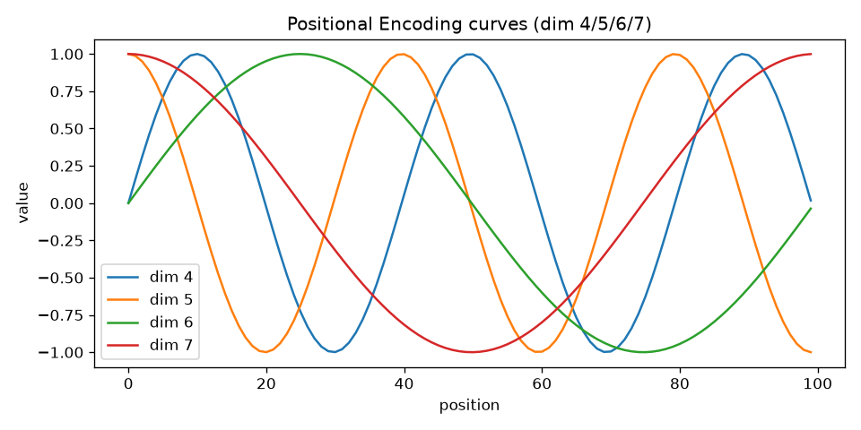
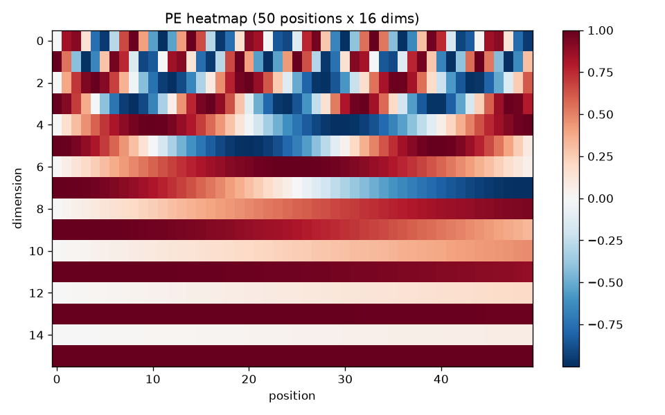
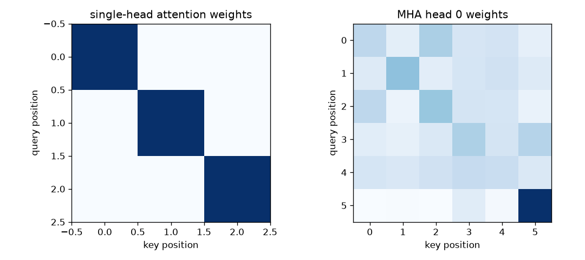
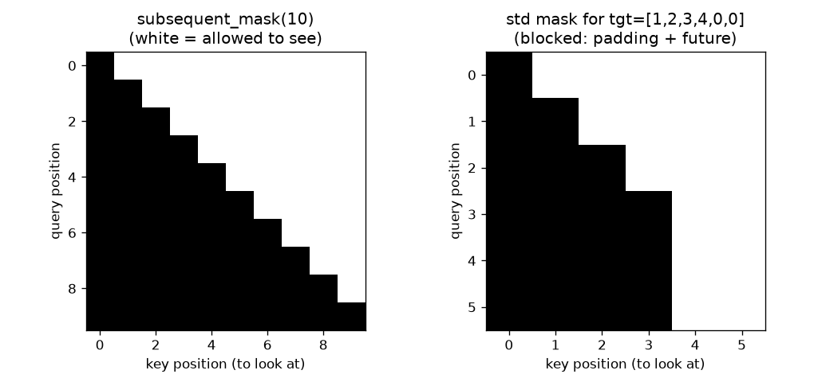
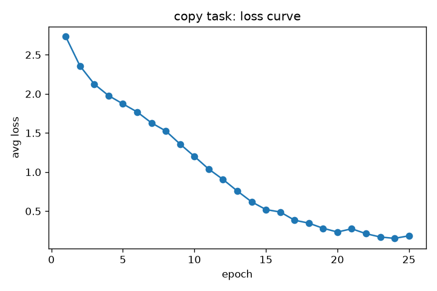

# 《Attention Is All You Need》Transformer 源码精读（完整版）

> 讲解对象：**Transformer（论文《Attention Is All You Need》, arXiv:1706.03762）** 的 PyTorch 源码。
> 本讲解基于 **harvardnlp/annotated-transformer**（MIT License, Alexander Rush 等）整理，
> 原文件在 code/the_annotated_transformer.py（行号以该文件为准，与本文标注一致）。
> 文中所有"运行效果"均由本机真实运行产生（Python 3.12 + PyTorch 2.6 CPU，脚本在 code/demos/）。

## 目录

- [第 1 章 宏观总览：先看懂这棵树](#第-1-章-宏观总览先看懂这棵树)
- [第 2 章 make_model：总装厂与数据流](#第-2-章-make_model总装厂与数据流)
- [第 3 章 词嵌入与位置编码](#第-3-章-词嵌入与位置编码)
- [第 4 章 缩放点积注意力与多头注意力（核心）](#第-4-章-缩放点积注意力与多头注意力核心)
- [第 5 章 前馈网络、残差连接、层归一化](#第-5-章-前馈网络残差连接层归一化)
- [第 6 章 编码器、解码器与三种掩码](#第-6-章-编码器解码器与三种掩码)
- [第 7 章 训练配套：Batch、损失、学习率](#第-7-章-训练配套batch损失学习率)
- [第 8 章 训练与推理：完整跑通](#第-8-章-训练与推理完整跑通)
- [第 9 章 一页纸总结 + 一分钟回顾](#第-9-章-一页纸总结--一分钟回顾)
- [附录：自己动手运行](#附录自己动手运行)

---

# 第 1 章 宏观总览：先看懂这棵树

## 1.1 论文在解决什么问题

Transformer 是**序列到序列（seq2seq）**模型，最典型用途是机器翻译：输入一整句源语言，
输出一整句目标语言。论文的核心主张就一句话：

> **不用 RNN/CNN，全靠"注意力"（attention）+ 简单全连接网络，就能把序列变换做得又快又好。**

英文名拆解（帮记忆）：

| 词 | 拆解 | 含义 |
|---|---|---|
| Transformer | transform（变换）+ er（者） | 变换器：把输入序列变换成输出序列 |
| Attention | at（向）+ tent（伸展）+ tion | 注意力：有选择地把"注意力"投向某些位置 |
| Encoder | encode（编码）+ r | 编码器：负责"读"，把整句提炼成记忆 |
| Decoder | decode（解码）+ r | 解码器：负责"写"，边看记忆边逐个词生成 |
| Scaled Dot-Product | scaled（缩放过的）+ dot product（点积） | 用点积打分，再除以根号 d_k 缩放 |
| Multi-Head | multi（多）+ head（头） | 多头：多个注意力并行，各看各的 |

## 1.2 架构总览（一张图）

`
源句子（n 个词序号）                   目标句子（已生成的部分）
        │                                      │
        ▼                                      ▼
  词嵌入 Embeddings                    词嵌入 Embeddings
  + 位置编码 PositionalEncoding        + 位置编码 PositionalEncoding
        │                                      │
        ▼                                      ▼
  ┌───────────────┐                     ┌──────────────────────┐
  │ Encoder × 6 层 │                    │ Decoder × 6 层        │
  │ 每层：          │                    │ 每层：                 │
  │ ①自注意力       │                    │ ①掩码自注意力(防作弊)    │
  │ ②前馈网络       │                    │ ②交叉注意力(读Encoder)  │
  └───────┬───────┘                     │ ③前馈网络              │
          │ memory = 编码结果(记忆)      └──────────┬───────────┘
          └────────────────────────────────────────►│
                                                     ▼
                                            线性层 + log-softmax
                                                     ▼
                                           预测"下一个词"的概率分布
`

注意图上两个输入口：
- **Encoder** 一次性读完整句源语言；
- **Decoder** 每次读"已经生成的词"，逐词预测下一个（训练时一次给整句但用掩码挡住未来）。

## 1.3 为什么不用 RNN/CNN（宏观原因）

| 对比项 | RNN | CNN | Transformer |
|---|---|---|---|
| 并行性 | 必须逐词串行 | 可并行 | **可并行**（训练快，这是它后来统治 NLP 的根本原因） |
| 长距离依赖 | 隔得越远越难记住 | 靠堆层数扩大视野 | **任意两个词一步直达** |
| 计算复杂度 | 串行 × 每步 O(n) | 卷积局部视野 | 每层 O(n²)（长文本较贵） |
| 顺序信息 | 天然按时间顺序 | 靠位置 | **本身不知道顺序**，必须额外加位置编码 |

## 1.4 三种注意力（先打个预防针，第 4、6 章细讲）

| 名字 | 谁在关注谁 | 在哪个组件里 | 能否看未来 |
|---|---|---|---|
| 自注意力 self-attention | 输入词 ↔ 输入词 | Encoder 每层第 ① 步 | 能（整句都可见） |
| 掩码自注意力 masked self-attn | 已生成词 ↔ 已生成词 | Decoder 每层第 ① 步 | **不能**（防作弊） |
| 交叉注意力 cross-attention | 已生成词 ↔ Encoder 的记忆 | Decoder 每层第 ② 步 | 原句全部可见 |

"自"的意思是 Q/K/V 来自同一个地方（自己跟自己算关系）；"交叉"是 Q 来自解码端、K/V 来自编码端。

## 1.5 五个"为什么"（宏观层面先立起来）

1. **为什么需要位置编码？** 注意力对位置不敏感：把两个词换个顺序，注意力算出的结果顺序也换，但"谁在第几个位置"的信息丢失了。没有递归的 Transformer 必须人为把位置注入，这是"去掉 RNN"的直接代价，不是锦上添花。
2. **为什么多头？** 一个注意力只能学一种关注模式；多头 = 一组专家，每人从不同角度（语法、指代、语义……）看同一句话，最后把结果拼起来（类比：开评审会，多个人各看一个方面）。
3. **为什么解码要掩码（mask）？** 训练时让模型"预测下一个词"。如果不遮住未来词，模型直接抄答案；掩码把未来位置的分数设成 -∞，softmax 后权重为 0，模型只能依赖已生成的词。
4. **为什么残差 + 层归一化？** 6 层×2 个子层之后网络很深；残差让每层只要学"增量"（x + 变化量），梯度更容易回传；层归一化把数值拉回稳定范围，训练才稳。
5. **为什么中间要放大 4 倍（d_ff=2048）？** 前馈网络给每个位置一个"独立思考空间"：先映射到高维再做非线性，增强表达能力（第 5 章细讲）。

## 1.6 代码地图：零件 → 拼装

原文件 `the_annotated_transformer.py 中模型核心（行 143-880）按依赖顺序如下：

| 代码 | 行号 | 作用 | 名字怎么记 |
|---|---|---|---|
| ttention() | 519 | 缩放点积注意力（数学核心） | 就是"Q·Kᵀ/√d_k → softmax → 加权 V" |
| MultiHeadedAttention | 589 | 多头注意力 | 切成 h 份并行算，再拼回 |
| PositionwiseFeedForward | 677 | 前馈网络 | position-wise=逐位置 |
| Embeddings | 704 | 词嵌入 | 词序号 → 向量 |
| PositionalEncoding | 748 | 位置编码 | 用 sin/cos 给位置编号 |
| LayerNorm | 315 | 层归一化 | 对每个向量做标准化 |
| SublayerConnection | 344 | 残差+归一"包装盒" | 每个子层外面套一层 |
| EncoderLayer/Encoder | 367/292 | 编码器单层/整机 | 自注意力+前馈，×N 层 |
| DecoderLayer/Decoder | 413/390 | 解码器单层/整机 | 三种子层，×N 层 |
| Generator | 256 | 输出头 | 线性层+log-softmax |
| EncoderDecoder | 230 | 总装 | 把上面全部接到一起 |
| make_model() | 822 | 工厂函数 | 给超参，返回完整模型 |
| subsequent_mask() | 441 | "禁看未来"掩码 | subsequent=后续的 |
| clones() | 286 | 复制 N 份相同子层 | clone=克隆 |

学代码的顺序 = 代码依赖顺序：**先零件，后拼装**。
建议先看第 2 章 make_model（拿到全局拼装图），再回来看每个零件是怎么造出来的。

## 1.7 下一步

第 2 章我们从"总装厂" make_model 出发，看清楚所有零件如何插在一起、张量如何流动；
之后的章节再逐个拆解零件。每章都配有真实运行输出，你可以跟着 code/demos/ 里的脚本亲手跑。


---

# 第 2 章 make_model：总装厂与数据流

## 2.1 先看整体

`make_model` 是模型的"工厂函数"：你给它词表大小等超参数，它返回一个装配完整的模型。
（源码行 822-843，注释为本文所加）

```python
def make_model(src_vocab, tgt_vocab, N=6, d_model=512, d_ff=2048, h=8, dropout=0.1):
    """辅助函数：用超参数构建一整个模型。"""
    c = copy.deepcopy   # 缩写：深拷贝，用来复制同一份"图纸"出多份独立零件

    # —— 造零件（每种零件造一个"模板"）——
    attn = MultiHeadedAttention(h, d_model)              # 多头注意力模板
    ff = PositionwiseFeedForward(d_model, d_ff, dropout) # 前馈模板
    position = PositionalEncoding(d_model, dropout)      # 位置编码模板

    # —— 总装：编码器、解码器、两侧嵌入、输出头 ——
    model = EncoderDecoder(
        Encoder(EncoderLayer(d_model, c(attn), c(ff), dropout), N),          # 编码器 N 层
        Decoder(DecoderLayer(d_model, c(attn), c(attn), c(ff), dropout), N), # 解码器 N 层
        nn.Sequential(Embeddings(d_model, src_vocab), c(position)),  # 源语言：嵌入+位置编码
        nn.Sequential(Embeddings(d_model, tgt_vocab), c(position)),  # 目标语言：嵌入+位置编码
        Generator(d_model, tgt_vocab),                 # 输出头：d_model -> 词表
    )

    # —— 参数初始化：论文用 Xavier 均匀分布（只初始化矩阵类参数）——
    for p in model.parameters():
        if p.dim() > 1:            # 向量类参数（如 LayerNorm 的 α/β）不初始化
            nn.init.xavier_uniform_(p)
    return model
```

### 逐块拆解

| 代码 | 在干什么 | 需要知道的点 |
|---|---|---|
| `c = copy.deepcopy` | 深拷贝"模板" | 同一份注意力模板被复制进每层。必须"深拷贝"：浅拷贝只共享同一组参数，所有层就变成同一层了 |
| `c(attn)` 出现 4 次 | 4 份**参数独立**的多头注意力 | 解码器有两个注意力（自注意力、交叉注意力），都从同一模板复制 |
| `nn.Sequential(Embeddings(...), c(position))` | 嵌入后接位置编码串成流水线 | 以后 `model.src_embed(src)` 一步完成"嵌入+加位置" |
| `nn.init.xavier_uniform_` | Xavier 均匀初始化 | 让矩阵参数量级适中，梯度更稳；`p.dim()>1` 才初始化，是因为 1 维参数（归一化的缩放/偏移）希望从 1/0 开始 |

> 记忆点：`deepcopy` = deep（深层）+ copy（复制）。浅拷贝 `copy()` 只复制外层引用，深拷贝把内部所有子对象一起复制。
> 这是 Transformer 复用"一层模板"堆出 N 层的正确方式。

## 2.2 总装类 EncoderDecoder：数据往哪流

（源码行 230-252）

```python
class EncoderDecoder(nn.Module):
    """标准的编码器-解码器架构。"""
    def __init__(self, encoder, decoder, src_embed, tgt_embed, generator):
        super(EncoderDecoder, self).__init__()
        self.encoder = encoder        # 编码器
        self.decoder = decoder        # 解码器
        self.src_embed = src_embed    # 源语言嵌入流水线
        self.tgt_embed = tgt_embed    # 目标语言嵌入流水线
        self.generator = generator    # 输出头

    def forward(self, src, tgt, src_mask, tgt_mask):
        """完整流程：编码 -> 用编码结果解码。"""
        return self.decode(self.encode(src, src_mask), src_mask, tgt, tgt_mask)

    def encode(self, src, src_mask):
        return self.encoder(self.src_embed(src), src_mask)

    def decode(self, memory, src_mask, tgt, tgt_mask):
        return self.decoder(self.tgt_embed(tgt), memory, src_mask, tgt_mask)
```

拆解：
- `encode`：`src`（词序号矩阵，形状 `(batch, src_len)`）先过嵌入流水线变成 `(batch, src_len, d_model)`，再进 N 层编码器，得到 **memory**（编码结果，形状不变）。
- `decode`：`tgt`（已生成/训练用的目标词序号）同样嵌入，解码器以 memory 为"记忆"逐层处理。
- 返回值是解码器输出（`(batch, tgt_len, d_model)`），**还没**过输出头——输出头在算损失/解码时才用（见第 7、8 章），这是源码的设计选择。

## 2.3 Generator：最后的输出头

（源码行 256-264）

```python
class Generator(nn.Module):
    def __init__(self, d_model, vocab):
        super(Generator, self).__init__()
        self.proj = nn.Linear(d_model, vocab)   # 线性层：d_model 维 -> 词表大小维

    def forward(self, x):
        return log_softmax(self.proj(x), dim=-1)  # 按词表维做 log-softmax
```

- `nn.Linear(d_model, vocab)`：每个位置的 d_model 维向量 → vocab 个"分数"（每个词一个）。
- `log_softmax(..., dim=-1)`：把分数变成 log 概率（数值更稳定的写法；后面损失用 KLDivLoss 天然要 log 概率，见第 7 章）。
- 词根：`prob`=概率，`proj`=projection 投影。

## 2.4 运行效果：真实形状流水线

运行 `code/demos/demo04_model.py`（小号模型：N=2, d_model=32, h=4，词表 11），屏幕输出：

```text
模型总参数: 43.9k

输入张量：src (2, 6) tgt (2, 5)

src 嵌入后 (batch, len, d_model): (2, 6, 32)
编码器输出 memory: (2, 6, 32)
tgt 嵌入后: (2, 5, 32)
解码器输出: (2, 5, 32)
输出层 log-softmax: (2, 5, 11) （覆盖整个词表 11）
model(...) 一步到位的结果形状: (2, 5, 32)
```

观察：
- **任何位置、任何阶段的向量维数都不变**（都是 d_model=32）——这是残差连接能成立的物理前提（第 5 章）。
- `(batch, len, d_model)` 是全程统一布局：batch 在最前，序列长度居中。
- 输出层把 `(2,5,32)` 变为 `(2,5,11)`：每个位置对 11 个词的打分。
- `model(...)` 直接返回 `(2,5,32)`（解码器输出），Generator 被刻意留到损失/解码时才调。

**常见坑**：
1. `(batch, len, d_model)` 和 `(len, batch, d_model)` 两种布局混用（老代码常用后者）——统一看 `d_model` 在哪个维度（这里恒为最后一维）。
2. 忘掉 `model.eval()` / 不关 dropout，推理结果不稳定（第 8 章专门讲）。
3. 词表维是 `vocab`，别和序列维搞混：输出永远多一个"词表维"。

---

# 第 3 章 词嵌入与位置编码

## 3.1 Embeddings：词 → 向量

（源码行 704-712）

```python
class Embeddings(nn.Module):
    def __init__(self, d_model, vocab):
        super(Embeddings, self).__init__()
        self.lut = nn.Embedding(vocab, d_model)   # 查表：词序号 -> d_model 维向量
        self.d_model = d_model

    def forward(self, x):
        return self.lut(x) * math.sqrt(self.d_model)   # 乘 sqrt(d_model) 放大
```

拆解：
- `nn.Embedding(vocab, d_model)`：本质是一张 `(vocab, d_model)` 的可学习查表，输入词序号，输出对应行向量。`lut` = look-up table（查找表）。
- **为什么乘 `sqrt(d_model)`**：位置编码的量级固定（sin/cos ∈ [-1,1]），词嵌入的方差随 d_model 变大而变大。先把嵌入放大到与位置编码可比，避免位置编码被"淹没"。这是论文的设计细节，有些复现代码会略去。

## 3.2 PositionalEncoding：给每个位置"发座位号"

（源码行 748-768）

```python
class PositionalEncoding(nn.Module):
    def __init__(self, d_model, dropout, max_len=5000):
        super(PositionalEncoding, self).__init__()
        self.dropout = nn.Dropout(p=dropout)

        pe = torch.zeros(max_len, d_model)               # 预计算整张位置编码表
        position = torch.arange(0, max_len).unsqueeze(1) # (max_len, 1) 位置编号
        div_term = torch.exp(
            torch.arange(0, d_model, 2) * -(math.log(10000.0) / d_model)
        )   # 频率随维数衰减
        pe[:, 0::2] = torch.sin(position * div_term)     # 偶数维用 sin
        pe[:, 1::2] = torch.cos(position * div_term)     # 奇数维用 cos
        pe = pe.unsqueeze(0)                             # (1, max_len, d_model)
        self.register_buffer("pe", pe)                   # 注册为缓冲区，随模型保存

    def forward(self, x):
        x = x + self.pe[:, : x.size(1)].requires_grad_(False)  # 截取当前长度并相加
        return self.dropout(x)
```

### 公式对应（论文 3.5 节）

```
PE(pos, 2i)   = sin(pos / 10000^(2i/d_model))    偶数维（i=0,1,2,...）
PE(pos, 2i+1) = cos(pos / 10000^(2i/d_model))    奇数维
```

代码逐行对应：
| 代码 | 对应公式 | 解释 |
|---|---|---|
| `position` | pos | 每个位置的编号，`(max_len, 1)` 为了和维数广播 |
| `div_term` | 1/10000^(2i/d_model) | 用 `torch.exp` 实现（等价于 `10000 ** (-2i/d_model)`，数值更稳）。i 越大（维数越高），频率越低 |
| `pe[:, 0::2]` / `[1::2]` | 偶数维 sin / 奇数维 cos | `0::2` = 从 0 开始每隔 2 取一个（Python 切片语法） |
| `unsqueeze(0)` | — | 变成 `(1, max_len, d_model)`，方便和 `(batch, len, d_model)` 广播 |
| `register_buffer` | — | 告诉 PyTorch："这个张量随模型保存/搬设备，但不参与梯度更新" |

> **为什么正弦/余弦？** 要满足两个要求：① 每个位置有独一无二的编码；② 任意两个位置的关系（比如"3 位之后"）可以用线性变换表达，词向量加上它后模型容易学到相对位置。sin/cos 满足这两点，且不用训练，长度还能外推。

### 逐行拆 `forward`
- `self.pe[:, : x.size(1)]`：按当前 batch 的序列长度截取（训练时序列长短不一）。
- `requires_grad_(False)`：明确告诉 PyTorch 不对位置编码求梯度（它是固定的）。
- `x + ...`：广播相加——`(batch, len, d_model) + (1, len, d_model)`，每个 batch 成员加上同一套"座位号"。
- `self.dropout(x)`：论文对"嵌入+位置编码"之和做 dropout，正则化手段（训练时随机丢弃一部分元素防过拟合；`p=0.1` 是论文默认）。

## 3.3 运行效果：位置编码长什么样

运行 `code/demos/demo02_posenc.py`，真实输出：

```text
位置编码表形状 (max_len, d_model): (50, 16)

前 5 个位置、前 4 个维度的值：
        dim0(sin)   dim1(cos)   dim2(sin)   dim3(cos)
pos 0:     0.0000     1.0000     0.0000     1.0000
pos 1:     0.8415     0.5403     0.3110     0.9504
pos 2:     0.9093    -0.4161     0.5911     0.8066
pos 3:     0.1411    -0.9900     0.8126     0.5828
pos 4:    -0.7568    -0.6536     0.9536     0.3011

同一维度 0 随位置变化（sin 波）：
   0.0000  0.8415  0.9093  0.1411 -0.7568 -0.9589 -0.2794  0.6570  0.9894  0.4121 -0.5440 -1.0000
同一维度 1 随位置变化（cos 波）：
   1.0000  0.5403 -0.4161 -0.9900 -0.6536  0.2837  0.9602  0.7539 -0.1455 -0.9111 -0.8391  0.0044
```

肉眼看三点：
1. **偶数维是 sin、奇数维是 cos**：`pos 0` 时 dim0=0、dim1=1（sin0=0, cos0=1）。
2. **低维变化快、高维变化慢**：dim0 周期短，dim 越高周期越长，到高维几乎平缓。
3. 每个位置的 16 维向量都不相同 → 位置可区分。

论文经典可视化（`images/fig_posenc_curves.png`）：



热力图版（`images/fig_posenc_heatmap.png`）：横轴位置、纵轴维度，颜色深浅即数值。



**常见坑**：
1. 位置编码加到嵌入上之前**必须**确认两个张量维度一致（都是 d_model），否则广播会悄悄出错（这里的广播只沿 batch 维进行）。
2. `register_buffer` vs `nn.Parameter`：想要"随模型保存但不训练"用 buffer；想要"随模型训练"用 Parameter。位置编码固定不变 → buffer 正确。
3. 切片 `0::2` 从 0 开始取偶数下标；`1::2` 从 1 开始取奇数下标。注意偶数维是 **sin**（和论文图一致）。


---

# 第 4 章 缩放点积注意力与多头注意力（核心）

这一章是全篇的心脏。先看最底层公式，再看多头怎么拼装，最后看真实输出。

## 4.1 最底层的 attention()：缩放点积注意力

（源码行 519-528）

```python
def attention(query, key, value, mask=None, dropout=None):
    """缩放点积注意力。返回：(加权求和后的 value, 注意力权重矩阵)"""
    d_k = query.size(-1)                                   # 每个头的维数
    scores = torch.matmul(query, key.transpose(-2, -1)) / math.sqrt(d_k)  # Q·Kᵀ / √d_k
    if mask is not None:
        scores = scores.masked_fill(mask == 0, -1e9)       # 被遮的位置塞大负数
    p_attn = scores.softmax(dim=-1)                        # 对"key 维"做 softmax
    if dropout is not None:
        p_attn = dropout(p_attn)                           # 对权重做 dropout
    return torch.matmul(p_attn, value), p_attn             # 加权求和 + 返回权重
```

### 逐行拆解

| 行 | 在干什么 | 细节 |
|---|---|---|
| `d_k = query.size(-1)` | 取向量维数 | 单头时就是 d_model，多头时是 d_k（= d_model/h） |
| `key.transpose(-2, -1)` | K 转置 | 把 K 的"序列维"和"向量维"互换，让 Q 和 K 能矩阵相乘（点积打分）；`transpose(-2,-1)` 是"交换倒数第一、第二维"的正规写法 |
| `torch.matmul(...) / math.sqrt(d_k)` | 打分 + 缩放 | **为什么除以 √d_k**：打分是 d_k 个数相乘求和，维数越大分数方差越大，softmax 会"两极分化"（一个接近 1，其余接近 0），梯度消失。除以 √d_k 把方差压回 1。这是论文最关键的数值设计之一 |
| `masked_fill(mask == 0, -1e9)` | 掩码 | mask 里为 False（=0）的位置，分数被替换成 -1e9（一个极大的负数）。softmax 后这些位置权重 ≈ 0。**为什么不用 0**：softmax 是 `e^x / Σe^x`，0 的指数是 1，仍会分到权重；必须用"负无穷量级" |
| `softmax(dim=-1)` | 归一化成权重 | 对最后一个维（key 维）做：每个 query 行，它看各 key 的权重和为 1 |
| `dropout(p_attn)` | 权重 dropout | 训练时随机把一部分注意力权重置 0（再缩放），相当于"随机不看某些词"，正则化手段 |
| `torch.matmul(p_attn, value)` | 加权求和 | 输出 = 每个位置按权重混合所有 value |

### 抽象类比（记 Q/K/V 用）
想象图书馆找书：你有一个**问题**（Query，"哪本书讲 X？"），每本书有**索引标签**（Key），书架上放着**内容**（Value）。
- 分数 = 你的问题与每本书标签的匹配程度（Q·K）；
- 归一化后 = 你给每本书分配多少注意力；
- 结果 = 各本书内容的加权混合。

词根记忆：`query`=询问/问题，`key`=钥匙/标签，`value`=值/内容。三个词都以字母 Q/K/V 简称。

### 运行效果：手算一遍

运行 `code/demos/demo03_attention.py` 的第一段（q=k=单位向量、三个 value 互不相同），屏幕输出：

```text
单头示例：q=k=单位向量，v 是 3 个互不相同的向量
注意力权重矩阵 (每行和为 1)：
[[0.452 0.274 0.274]
 [0.274 0.452 0.274]
 [0.274 0.274 0.452]]
加权结果 = 每行权重 x 对应 v：
[[4.52 5.48]
 [2.74 9.04]
 [2.74 5.48]]
行和检查: [1. 1. 1.]
```

看懂三件事：
1. 第 0 行 = 第 0 个 query 对所有 key 的权重：自己 0.452、别人 0.274——因为 q0 只和 k0 完全匹配（点积=1），和另外两个点积=0。
2. **每行和为 1**：softmax 保证。
3. 输出第 0 行 = `0.452×v0 + 0.274×v1 + 0.274×v2`：自己"内容"占大头。

再看带掩码的效果（同一脚本第二段）：

```text
带 subsequent_mask(3) 的注意力权重（左下严格为 0，即看不到未来）：
[[1.    0.    0.   ]
 [0.035 0.965 0.   ]
 [0.307 0.251 0.442]]
```

- 第 0 行只能看位置 0 → 权重全给位置 0；
- 第 1 行只能看位置 0、1 → 权重 [0.035, 0.965, 0]；未来位置 2 严格是 0；
- 第 2 行三个位置都能看，权重分散。
这就是"掩码 = 把未来位置的分数设成 -1e9"的实际效果。

## 4.2 MultiHeadedAttention：多头注意力

（源码行 589-628）

```python
class MultiHeadedAttention(nn.Module):
    def __init__(self, h, d_model, dropout=0.1):
        super(MultiHeadedAttention, self).__init__()
        assert d_model % h == 0            # 必须能整除，否则没法均分
        self.d_k = d_model // h            # 每个头的维数（论文：512/8=64）
        self.h = h
        self.linears = clones(nn.Linear(d_model, d_model), 4)  # W_Q, W_K, W_V, W_O
        self.attn = None                   # 记录最近一次权重，便于可视化
        self.dropout = nn.Dropout(p=dropout)

    def forward(self, query, key, value, mask=None):
        if mask is not None:
            mask = mask.unsqueeze(1)       # 掩码加一维，后面广播
        nbatches = query.size(0)

        # ① 投影 + 切头：Q/K/V 各自过线性层，然后
        #    (b, len, d_model) -> (b, len, h, d_k) -> (b, h, len, d_k)
        query, key, value = [
            lin(x).view(nbatches, -1, self.h, self.d_k).transpose(1, 2)
            for lin, x in zip(self.linears, (query, key, value))
        ]

        # ② 多头同时做缩放点积注意力（mask 广播到所有头）
        x, self.attn = attention(query, key, value, mask=mask, dropout=self.dropout)

        # ③ 把 h 个头拼接回一个向量：
        #    (b, h, len, d_k) -> (b, len, h, d_k) -> (b, len, d_model)
        x = (
            x.transpose(1, 2)
            .contiguous()                  # view 前必须内存连续
            .view(nbatches, -1, self.h * self.d_k)
        )
        return self.linears[-1](x)         # ④ 输出投影 W_O
```

### 逐块拆解

**① 4 个线性层是什么**：论文 Figure 2 里有 4 个可学习矩阵 W_Q、W_K、W_V（进入多头前各投影一次）和 W_O（拼接后投影一次）。这里 `clones(nn.Linear(d_model, d_model), 4)` 恰好对应这 4 个矩阵，用同一个模板复制 4 份独立参数。

**② `view` + `transpose` 切头是怎么回事**：
- `view(nbatches, -1, self.h, self.d_k)`：把 `(b, len, d_model)` 重排成 `(b, len, h, d_k)`。`-1` = 让 PyTorch 自动推断 len。d_model = h × d_k，所以能均分。
- `.transpose(1, 2)`：把"头维"挪到第 2 位，变成 `(b, h, len, d_k)`。
- 之后 `attention()` 在最后两维上做矩阵乘法：`(b, h, q_len, d_k) @ (b, h, d_k, k_len)`——**h 个头的注意力并行、互不干扰地同时算**。
- 类比：把一条 512 维的"信息河"切成 8 条 64 维的"支流"，8 个注意力各自在自己的支流里算，最后再合成一条河。

**易混点：`view` vs `reshape` vs `transpose`**

| 操作 | 是否改内存布局 | 速度 | 坑 |
|---|---|---|---|
| `view` | 不改（要求原张量内存连续） | 快（零拷贝） | 内存不连续直接报错 |
| `reshape` | 必要时自动拷贝 | 快 | 行为像 view+contiguous 二合一，语义较隐晦 |
| `transpose` | 改"逻辑顺序"，内存不变 | 快（零拷贝） | 结果是**非连续**的，之后 `view` 会报错 |

所以源码在 `transpose(1,2)` 之后必须 `.contiguous()` 再 `view`——这是 PyTorch 里最经典的报错现场之一：`RuntimeError: view size is not compatible with input tensor's size...`。记忆：**transpose 之后还想 view，先 contiguous**。

**③ mask 怎么广播到所有头**：scores 形状 `(b, h, q_len, k_len)`；传入的 mask 原始形状 `(b, 1, k_len)`（每个 batch 一条"允许看哪些 key"），`unsqueeze(1)` 后变成 `(b, 1, 1, k_len)`，广播规则自动把它复制到 h 个头、q_len 行——**同一个掩码对每个头都生效**。

**④ 为什么输出投影**：8 个头各算各的，拼回 512 维后学一个混合矩阵，让模型决定"每个头的结果怎么融合"。

### 与另一个主流实现的差异（对照 jadore801120 版，帮你防混）

| | 本代码（哈佛版） | jadore 版 |
|---|---|---|
| 头的划分 | d_model 均分：d_k = d_v = d_model / h | d_k、d_v 可**分别指定**（更灵活，论文原文就有 d_k≠d_v 的情况） |
| 参数量 | 4 个 d_model×d_model 线性层 | 同样 4 个，但形状按 d_k/d_v 调整 |
| 适用 | 教学、代码整洁 | 灵活调参、复现论文各种变体 |

结论：哈佛版固定 `d_k = d_v`，因为论文主模型就是这么配的；两个版本**数学等价**，只是参数化方式不同。

### 运行效果：多头形状与权重

继续跑 `demo03_attention.py` 第三段（h=4, d_model=16, batch=2, len=6）：

```text
多头注意力输入 x: (2, 6, 16) -> 输出 y: (2, 6, 16)
内部注意力权重 self.attn 形状: (2, 4, 6, 6) (batch, heads, q_len, k_len)
第 0 个头对第 0 个 batch 的权重（行和为 1）：
[[0.226 0.103 0.269 0.149 0.16  0.093]
 [0.123 0.325 0.103 0.153 0.172 0.124]
 [0.228 0.073 0.307 0.158 0.153 0.08 ]
 [0.107 0.092 0.134 0.265 0.156 0.247]
 [0.152 0.137 0.172 0.208 0.196 0.134]
 [0.03  0.034 0.031 0.113 0.046 0.745]]
行和检查: [1. 1. 1. 1. 1. 1.]
```

输出热力图可视化（`images/fig_attn_weights.png`）：



注意点：
- 输出形状和输入**完全一样** `(b, len, d_model)`——注意力不会改变形状，只"重组信息"，这让它像积木一样随意堆叠。
- `self.attn` 被保存在模型里：训练完可以取出来画"某个头在看谁"的热力图（原仓库的可视化部分就是这样做的）。
- 随机初始化时权重近似均匀；训练后每个头会形成**不同的关注模式**（语法、指代、语义……），这就是"多头"的意义。

### 本章常见坑汇总
1. **mask 语义**：本代码 `mask == 0` 的位置被遮（mask 里 True=允许看）。不同实现可能反过来（True=遮住），看代码时先确认语义。
2. **`-1e9` vs `-inf`**：两种写法都存在；`-1e9` 避免 NaN 风险，效果等价。
3. **忘记 `.contiguous()`**：transpose 后 view 直接报错（上面已讲）。
4. **`self.attn = None` 的坑**：如果模型从未跑过 forward，`attn` 是 None；可视化前保证先 forward 一次。
5. **dropout 位置**：这里是作用在权重矩阵上（论文做法），不是作用在输入上——两处 dropout 作用不同，别混。


---

# 第 5 章 前馈网络、残差连接、层归一化

编码器/解码器层里除了注意力，剩下三件"小事"都在这章——但它们是深层网络能训练起来的关键。

## 5.1 PositionwiseFeedForward：逐位置前馈网络

（源码行 677-688）

```python
class PositionwiseFeedForward(nn.Module):
    def __init__(self, d_model, d_ff, dropout=0.1):
        super(PositionwiseFeedForward, self).__init__()
        self.w_1 = nn.Linear(d_model, d_ff)   # 先放大：512 -> 2048
        self.w_2 = nn.Linear(d_ff, d_model)   # 再缩回：2048 -> 512
        self.dropout = nn.Dropout(dropout)

    def forward(self, x):
        return self.w_2(self.dropout(self.w_1(x).relu()))  # Linear -> ReLU -> Dropout -> Linear
```

拆解：
- 公式：`FFN(x) = W_2 * ReLU(W_1 * x + b_1) + b_2`（论文 3.3 节）。两个线性层夹一个 ReLU。
- **"逐位置"（position-wise）**：对序列里每个位置的向量**各自独立**做同样计算，位置之间不交换信息（信息交换只发生在注意力里）。`w_1`/`w_2` 是所有位置共享的同一组参数。
- **为什么中间放大到 2048（4 倍）**：低维空间线性不可分，先映射到高维做非线性变换，再用第二个线性层压回 d_model。宽度大 → 每个位置有更强的"独立思考"能力。这也是 Transformer 参数量的大头。
- 词根：`feed-forward` = 前馈（信息只往前走、不回传结构）。
- 和注意力配合的理解：**注意力负责"位置之间"的信息交换，前馈负责"每个位置内部"的加工**——各司其职。

## 5.2 LayerNorm：层归一化

（源码行 315-328）

```python
class LayerNorm(nn.Module):
    def __init__(self, features, eps=1e-6):
        super(LayerNorm, self).__init__()
        self.a_2 = nn.Parameter(torch.ones(features))   # 可学习缩放（对应论文 γ）
        self.b_2 = nn.Parameter(torch.zeros(features))  # 可学习偏移（对应论文 β）
        self.eps = eps

    def forward(self, x):
        mean = x.mean(-1, keepdim=True)   # 对最后一维（d_model）求均值
        std = x.std(-1, keepdim=True)     # 求标准差
        return self.a_2 * (x - mean) / (std + self.eps) + self.b_2
```

拆解：
- 对**每个位置的 d_model 维向量**做"减均值、除标准差"，得到均值 0、方差 1 的标准向量；再乘可学习的 `a_2`、加 `b_2`（让网络决定"要不要恢复原来的量级"）。
- **为什么是 LayerNorm 而不是 BatchNorm**（易混点，划重点）：

| | 对谁归一化 | 适合场景 | 为什么这里选它 |
|---|---|---|---|
| BatchNorm | 对**同一个维、不同样本**归一化 | 固定长度的图像数据 | 序列长度可变、batch 变小就不稳 |
| LayerNorm | 对**同一个样本内、不同特征维**归一化 | 序列/文本/变长数据 | 不依赖 batch 大小，长度变化也稳 |

> 类比：BatchNorm 是"全班同学比身高"（同学=batch），LayerNorm 是"一个人量全身比例"（身体部位=特征维）。

- `nn.Parameter`：把普通张量标记为"可训练参数"，会自动进 `model.parameters()` 被优化器更新。
- 细节：`std` 默认用"样本标准差"（除 n-1）；`eps` 防止除 0。这个手写实现和 `torch.nn.LayerNorm` 等价（后者还支持更多用法）。

## 5.3 SublayerConnection：残差 + 归一化的"包装盒"

（源码行 344-358）

```python
class SublayerConnection(nn.Module):
    def __init__(self, size, dropout):
        super(SublayerConnection, self).__init__()
        self.norm = LayerNorm(size)          # 一个归一化
        self.dropout = nn.Dropout(dropout)   # 一个 dropout

    def forward(self, x, sublayer):
        return x + self.dropout(sublayer(self.norm(x)))   # x + 子层(归一化(x))
```

拆解：
- `sublayer` 是一个"函数"（或可调用模块），由调用方传入（编码器层传注意力/lambda，解码器层同理，第 6 章看用法）。
- 数据流：`x → 归一化 → 子层 → dropout → 加回原 x`。
- **为什么残差（x + ...）**：梯度回传时多一条"直通高速公路"（对 x 的梯度天然是 1），深层网络梯度不容易消失；每层只需要学"增量"。
- **为什么子层前先归一化**：源码注释明说了——`Note for code simplicity the norm is first as opposed to last`（为了代码简洁，norm 放在前面）。论文图里画的是"子层之后加 Norm"（post-norm），这里实现的是"子层之前 Norm"（pre-norm 风味）。两者都有人用：

| | 顺序 | 特点 |
|---|---|---|
| 论文图意（post-norm） | 子层 → Norm → 残差加 | 原始实现；深层时训练需要小心 |
| 本代码（norm-first） | Norm → 子层 → 残差加 | 现在大模型主流（pre-norm），训练更稳 |

**这只影响数值细节，不影响架构理解**；看别人代码时先判断它属于哪种。

- 这个类是理解编码器/解码器层结构的"钥匙"：每个子层外面套一层这样的盒子，所以 `EncoderLayer` 里有 2 个盒子，`DecoderLayer` 里有 3 个（见下一章）。

**本章坑位**：
1. LayerNorm `std` 默认是"无偏估计"（`unbiased=True` 除 n-1），极短序列时和 torch.nn.LayerNorm 数值略有差异，不影响使用。
2. 残差的硬性要求：**残差两端的形状必须完全一致**（都是 `(b, len, d_model)`）——这就是为什么注意力/前馈都保持形状不变。
3. 手写 `nn.Parameter` 记得调 `requires_grad`（默认 True）；如果误用 `register_buffer` 存可训练参数，参数不会更新（反向坑）。

---

# 第 6 章 编码器、解码器与三种掩码

## 6.1 clones：为什么"复制"就能得到 N 层

（源码行 286-288）

```python
def clones(module, N):
    """复制出 N 个相同模块（各自独立参数）。"""
    return nn.ModuleList([copy.deepcopy(module) for _ in range(N)])
```

- `nn.ModuleList`：装模块的"列表"，会被 PyTorch 自动登记（遍历 `model.parameters()` 时能找到里面所有参数）。
- `deepcopy`：每层都复制一份**参数独立**的实例。若共用同一实例，所有层的权重会绑在一起更新（梯度平均），模型表达能力大打折扣。
- 记忆：`clone`=克隆，`ModuleList`=模块列表。

## 6.2 EncoderLayer：编码器的一层

（源码行 367-380，逐行注解）

```python
class EncoderLayer(nn.Module):
    def __init__(self, size, self_attn, feed_forward, dropout):
        super(EncoderLayer, self).__init__()
        self.self_attn = self_attn            # 自注意力模块
        self.feed_forward = feed_forward      # 前馈模块
        self.sublayer = clones(SublayerConnection(size, dropout), 2)  # 2 个包装盒
        self.size = size                      # d_model，Encoder 末尾的 LayerNorm 要用

    def forward(self, x, mask):
        # 盒子 0：装自注意力；q=k=v=同一个 x（所以叫"自"）
        x = self.sublayer[0](x, lambda x: self.self_attn(x, x, x, mask))
        # 盒子 1：装前馈网络
        return self.sublayer[1](x, self.feed_forward)
```

- **`lambda x: self.self_attn(x, x, x, mask)` 是什么**：延迟执行。`SublayerConnection.forward` 内部会调用 `sublayer(norm(x))`——它需要一个"给 x 就算出结果"的函数。lambda 把"self_attn 加掩码"包成一个函数，传进去；真正执行时它才拿 norm 后的 x 去算注意力。这是"把模块当函数传"的 Python 惯用法（函数是一等公民）。
- 顺序：**自注意力（词↔词）→ 前馈（逐词加工）**，各配一个残差盒。

## 6.3 DecoderLayer：解码器的一层

（源码行 413-430，逐行注解）

```python
class DecoderLayer(nn.Module):
    def __init__(self, size, self_attn, src_attn, feed_forward, dropout):
        super(DecoderLayer, self).__init__()
        self.size = size
        self.self_attn = self_attn    # 解码端的自注意力（被掩码保护）
        self.src_attn = src_attn      # 交叉注意力：读编码器记忆
        self.feed_forward = feed_forward
        self.sublayer = clones(SublayerConnection(size, dropout), 3)  # 3 个包装盒

    def forward(self, x, memory, src_mask, tgt_mask):
        m = memory
        # 盒子 0：掩码自注意力（tgt_mask 挡住未来词）
        x = self.sublayer[0](x, lambda x: self.self_attn(x, x, x, tgt_mask))
        # 盒子 1：交叉注意力（q 来自 x，k/v 来自记忆 m）
        x = self.sublayer[1](x, lambda x: self.src_attn(x, m, m, src_mask))
        # 盒子 2：前馈
        return self.sublayer[2](x, self.feed_forward)
```

对比记忆：

| | EncoderLayer | DecoderLayer |
|---|---|---|
| 子层数 | 2（自注意力、前馈） | 3（掩码自注意力、交叉注意力、前馈） |
| 注意力 | q=k=v=输入 x | ① q=k=v=输入 x（但被 tgt_mask 遮）；② q=输入 x，k=v=memory |
| 掩码 | 只传 src_mask（挡 padding） | 同时传 tgt_mask（挡未来）和 src_mask（挡 padding） |
| 对应论文图 | Figure 1 左 | Figure 1 右 |

**交叉注意力为什么是 `self.src_attn(x, m, m, src_mask)`**：query 问的是"我（解码端当前位置）需要什么信息"，key/value 回答的是"编码器记忆里有什么"——两边都来自 memory（m, m），只有 query 来自解码端 x。三个张量可以形状不同（解码长度≠源长度），注意力本身不要求它们一样长。

## 6.4 Encoder / Decoder：整机（堆 N 层）

（源码行 292-304 / 390-401）

```python
class Encoder(nn.Module):
    def __init__(self, layer, N):
        super(Encoder, self).__init__()
        self.layers = clones(layer, N)      # N 个相同层
        self.norm = LayerNorm(layer.size)   # 末尾加一个归一化

    def forward(self, x, mask):
        for layer in self.layers:           # 逐层往下传
            x = layer(x, mask)
        return self.norm(x)                 # 最后归一化

class Decoder(nn.Module):
    def __init__(self, layer, N):
        super(Decoder, self).__init__()
        self.layers = clones(layer, N)
        self.norm = LayerNorm(layer.size)

    def forward(self, x, memory, src_mask, tgt_mask):
        for layer in self.layers:
            x = layer(x, memory, src_mask, tgt_mask)
        return self.norm(x)
```

- 注意 Decoder 比 Encoder 多收 `memory`：每层都要读一遍编码器的输出。
- 末尾 LayerNorm 的作用：把最后一层的输出再"捋顺"一遍，再交给输出头。
- `layer.size` 是 `EncoderLayer` 里保存的 d_model（还记得吗），用于构造归一化层——**构造函数里就准备好**，不需要运行时再查。

## 6.5 subsequent_mask：怎么"挡未来"

（源码行 441-447）

```python
def subsequent_mask(size):
    """生成"禁止看未来"的掩码。"""
    attn_shape = (1, size, size)      # (1, 词数, 词数)：行=当前词，列=能看的词
    subsequent_mask = torch.triu(torch.ones(attn_shape), diagonal=1).type(torch.uint8)
    return subsequent_mask == 0
```

拆解：
- `torch.triu(..., diagonal=1)`：取**严格上三角**（对角线往上一格开始），未来位置=1。
- `.type(torch.uint8)`：转成 0/1 整数张量（`bool` 也行，这里用 uint8 与旧版 API 兼容）。
- `== 0`：取反，于是"允许看"的位置为 True。
- 结果形状 `(1, size, size)`：第 i 行第 j 列 = 第 i 个词能否看到第 j 个词（j ≤ i 才能看）。

### 运行效果：掩码长什么样

运行 `code/demos/demo01_masks.py`，真实输出：

```text
① subsequent_mask(5)：能看的位置是 True，禁看的位置是 False
[[ True False False False False]
 [ True  True False False False]
 [ True  True  True False False]
 [ True  True  True  True False]
 [ True  True  True  True  True]]

② 目标序列 tgt = [[1, 2, 3, 0, 0]]（0 表示 padding），pad=0
make_std_mask 结果：行=当前词位置，列=它能看的位置
[[ True False False False False]
 [ True  True False False False]
 [ True  True  True False False]
 [ True  True  True False False]
 [ True  True  True False False]]
```

左图是"纯防未来"三角，右图是加了 padding 的效果（第 3、4 行只能看自己：因为 0 是 padding，不允许看）。可视化（`images/fig_masks.png`）：



**三种掩码总表**（之前第 1 章立过，现在对照代码确认）：

| 掩码 | 谁生成 | 挡什么 | 作用对象 |
|---|---|---|---|
| `src_mask` | `(src != pad).unsqueeze(-2)` | padding 位置 | Encoder 自注意力、Decoder 交叉注意力 |
| `tgt_mask` | `make_std_mask` = padding 掩码 & subsequent_mask | padding + 未来 | Decoder 自注意力 |
| `subsequent_mask` | 纯函数 | 未来位置 | 被 tgt_mask 组合使用 |

矩阵广播细节：`src_mask` 形状 `(b, 1, src_len)`，在多头注意力里再 `unsqueeze(1)` 成 `(b, 1, 1, src_len)`，广播到所有头、所有 query 行。

**常用坑**：
1. `torch.triu` 的 `diagonal=1` 与 `diagonal=0` 差一个对角线：0 会允许"看自己"，1 是严格未来。写错一步，整个解码器行为就错了（但训练还能跑，只是损失不对——隐蔽 bug）。
2. 掩码张量类型：`mask == 0` 语义依赖掩码是 0/1 或 bool；如果掩码被转成 float 且值不是 0/1，比较会失配。
3. 训练时 `tgt` 完整给出（含未来词），靠掩码让模型"假装没看见"；推理时逐词拼接——**掩码是训练/推理一致性的关键**（第 8 章再展开）。


---

# 第 7 章 训练配套：Batch、损失、学习率

模型部分讲完了，进入"怎么训练"。先讲三个配套组件：数据批次与掩码、标签平滑损失、学习率调度。

## 7.1 Batch：把一个 batch 整理成形（含"错位"技巧）

（源码行 907-926）

```python
class Batch:
    """存放一个 batch 的 src/tgt，并生成好掩码。"""
    def __init__(self, src, tgt=None, pad=2):   # 2 = padding 占位符
        self.src = src
        self.src_mask = (src != pad).unsqueeze(-2)          # 源：非 padding 的位置=True
        if tgt is not None:
            self.tgt = tgt[:, :-1]      # 输入解码器：去掉最后一个词
            self.tgt_y = tgt[:, 1:]     # 预测目标：去掉第一个词（错位对齐）
            self.tgt_mask = self.make_std_mask(self.tgt, pad)
            self.ntokens = (self.tgt_y != pad).data.sum()   # 本批有效词数（损失按它平均）

    @staticmethod
    def make_std_mask(tgt, pad):
        """挡住 padding 和未来词。"""
        tgt_mask = (tgt != pad).unsqueeze(-2)               # 非 padding 掩码
        tgt_mask = tgt_mask & subsequent_mask(tgt.size(-1)).type_as(tgt_mask.data)  # 且上"禁未来"
        return tgt_mask
```

### 核心技巧：`tgt` 与 `tgt_y` 错一位（teacher forcing）

训练一个 batch 时，目标句子是完整的，但我们想让模型在"只看前 t-1 个词"的条件下预测第 t 个词：

```text
完整目标序列:  [开始, 词1, 词2, 词3, 结束]
                    ↓ 错位
模型输入 tgt:   [开始, 词1, 词2, 词3]      （丢掉最后一个）
预测目标 tgt_y: [词1, 词2, 词3, 结束]      （丢掉第一个）
```

- 第 t 步：模型看到前 t-1 个词，要预测第 t 个词 → 输入和输出正好错开一位。
- 词根记忆：`tgt` = target（目标），加后缀 `_y` 表示"这是要预测的标签"（机器学习里常用 y 表示标签）。
- 这一步**同时满足了"并行训练"**：一次 forward 就能算完整句每个位置的损失，不用像 RNN 那样逐词循环。
- 推理时没有完整句子，只能逐个词生成——这就是第 8 章 `greedy_decode` 循环的原因。

### 掩码合成（`&` 的作用）

`tgt_mask = 非 padding 掩码 & 禁未来掩码`：两个条件**同时满足**才允许看（`&` = 按位与）。第 6 章演示里已看过实际样子。

### `ntokens` 是什么

`(tgt_y != pad).sum()`：本批里"非 padding"的预测位置总数。损失按它平均（第 8 章 `run_epoch` 里 `/total_tokens`），避免长句多占便宜——**论文按 token 数而不是按句数平均**，这是翻译任务的标准做法。

## 7.2 LabelSmoothing：标签平滑（为什么不用"绝对正确"的标签）

（源码行 1148-1170）

```python
class LabelSmoothing(nn.Module):
    def __init__(self, size, padding_idx, smoothing=0.0):
        super(LabelSmoothing, self).__init__()
        self.criterion = nn.KLDivLoss(reduction="sum")  # 损失：KL 散度（要求输入是 log 概率）
        self.padding_idx = padding_idx
        self.confidence = 1.0 - smoothing   # 真标签分到的概率
        self.smoothing = smoothing
        self.size = size

    def forward(self, x, target):
        assert x.size(1) == self.size
        true_dist = x.data.clone()                        # 复制一份（只借形状）
        true_dist.fill_(self.smoothing / (self.size - 2)) # 所有词先分到平滑的小概率
        true_dist.scatter_(1, target.data.unsqueeze(1), self.confidence)  # 真标签位置放 confidence
        true_dist[:, self.padding_idx] = 0                # padding 词的概率永远是 0
        mask = torch.nonzero(target.data == self.padding_idx)  # 找到 padding 位置的行
        if mask.dim() > 0:
            true_dist.index_fill_(0, mask.squeeze(), 0.0) # 这些行整行清零（不参与损失）
        self.true_dist = true_dist
        return self.criterion(x, true_dist.clone().detach())  # KL(x_logprob || true_dist)
```

拆解：
- **为什么平滑**：普通交叉熵要求模型把真标签押到概率 1。模型为了"绝对自信"，会把 logits 推向无穷，训练后期过拟合、泛化差。标签平滑把"1"改成 `confidence`，把剩下的 `smoothing` 分给其他词——模型不用再追求极端自信。论文用 smoothing=0.1。
- 公式：`smoothing / (size - 2)`：总数 size 里，真标签占 1 个、padding 占 1 个（被排除），剩下 size-2 个词均分。
- `scatter_`：把 `confidence` 写到 `target` 指定的位置（原地操作，`_` 结尾 = in-place）。
- **为什么 KLDivLoss 而不是 CrossEntropyLoss**：KLDivLoss 接受"log 概率 + 目标分布"；Generator 输出的正好是 log-softmax。二者数学上等价，KL 写法方便直接喂"平滑后的分布"。`detach()` 防止目标分布被当成可导图的一部分。
- padding 处理：padding 位置既不给模型"正确标签"，概率也永远置 0——因为 padding 不是真词，模型不该预测它。

## 7.3 rate：学习率预热（warmup）公式

（源码行 1058-1067）

```python
def rate(step, model_size, factor, warmup):
    """第 step 步的学习率。"""
    if step == 0:
        step = 1                 # 防 0 的负次方（0^-0.5 会出错）
    return factor * (
        model_size ** (-0.5) * min(step ** (-0.5), step * warmup ** (-1.5))
    )
```

- 公式拆开看：`model_size^-0.5` 是常数缩放（模型越大，lr 越小）；`min(step^-0.5, step·warmup^-1.5)` 是两个阶段的切换：
  - **预热阶段**（step 小）：取 `step·warmup^-1.5`，随 step **线性上升**（从很小开始，逐步到峰值）；
  - **衰减阶段**（step 大）：取 `step^-0.5`，随 step **平方根下降**。
- **为什么先预热**：训练第 1 步时参数随机、梯度方向不可靠，直接上大学习率容易"一步起飞、然后爆炸"。先小步走几步（预热几百步），等梯度方向稳定再逐步加大，然后按 √ 衰减。这个"升→峰→降"曲线是 Transformer 稳定训练的关键（`example_simple_model` 里 Adam 的 `lr=0.5` 看起来很大，但被 rate 乘完，实际第 1 步只有约 0.0006，见第 8 章真实日志）。
- 和 `LambdaLR` 配合：`lr_lambda` 每个 step 被调用一次，返回缩放系数；`scheduler.step()` 在每 batch 之后调用（**每步调一次，不是每 epoch**——易错点）。

> 对比：普通训练常用"固定学习率"或"按 epoch 衰减"；Transformer 用"按 step 的 warmup+sqrt 衰减"，因为注意力训练的梯度尺度对步数更敏感。现在的大模型训练也普遍沿用 warmup。

---

# 第 8 章 训练与推理：完整跑通

## 8.1 run_epoch：训练/验证一个 epoch

（源码行 949-1000）

```python
def run_epoch(data_iter, model, loss_compute, optimizer, scheduler,
              mode="train", accum_iter=1, train_state=TrainState()):
    """跑一个 epoch。"""
    start = time.time()
    total_tokens, total_loss, tokens, n_accum = 0, 0, 0, 0
    for i, batch in enumerate(data_iter):
        out = model.forward(batch.src, batch.tgt, batch.src_mask, batch.tgt_mask)  # 前向
        loss, loss_node = loss_compute(out, batch.tgt_y, batch.ntokens)  # 损失

        if mode == "train" or mode == "train+log":     # 训练才更新参数
            loss_node.backward()                       # 反向传播
            train_state.step += 1
            train_state.samples += batch.src.shape[0]
            train_state.tokens += batch.ntokens
            if i % accum_iter == 0:                    # 梯度累积（显存不够时）
                optimizer.step()                       # 更新参数
                optimizer.zero_grad(set_to_none=True)  # 清梯度
                n_accum += 1
                train_state.accum_step += 1
            scheduler.step()                           # 学习率前进一步

        total_loss += loss
        total_tokens += batch.ntokens
        tokens += batch.ntokens
        if i % 40 == 1 and (mode == "train" or mode == "train+log"):
            lr = optimizer.param_groups[0]["lr"]
            elapsed = time.time() - start
            print("Epoch Step: %6d | Accumulation Step: %3d | Loss: %6.2f "
                  "| Tokens / Sec: %7.1f | Learning Rate: %6.1e"
                  % (i, n_accum, loss / batch.ntokens, tokens / elapsed, lr))
            start = time.time()
            tokens = 0
        del loss
        del loss_node          # 及时释放计算图内存
    return total_loss / total_tokens, train_state   # 整个 epoch 的平均 loss（按 token 平均）
```

拆解：
- `mode`："train" 才 backward/step；"eval" 只算损失（验证集用）。
- **梯度累积**（`accum_iter`）：显存小就多积累几个 batch 的梯度再更新一次（效果近似大 batch）。`i % accum_iter == 0` 时 step+清零。
- **为什么返回两个 loss**：`loss` 是被 norm 放回的"带量纲"数值（用于打印/统计），`loss_node` 是计算图节点（用于 backward）。分配清晰，见 8.2。
- 日志格式解读：`Tokens / Sec` 每秒处理 token 数（性能指标）；`Learning Rate` 当前 lr——训练时盯着这两列能快速判断"卡没卡"。
- `set_to_none=True`：比 `zero_grad()` 更省内存的现代写法（直接把梯度置 None）。

## 8.2 SimpleLossCompute：损失计算器

（源码行 1289-1304）

```python
class SimpleLossCompute:
    def __init__(self, generator, criterion):
        self.generator = generator   # 输出头（Generator）
        self.criterion = criterion   # 损失函数（LabelSmoothing）

    def __call__(self, x, y, norm):
        x = self.generator(x)                            # 解码器输出 -> log 概率
        sloss = (
            self.criterion(
                x.contiguous().view(-1, x.size(-1)),    # 展平：(batch*len, vocab)
                y.contiguous().view(-1),                 # 展平：(batch*len,)
            )
            / norm                                       # 除以本批有效 token 数
        )
        return sloss.data * norm, sloss   # ① 打印用的真实 loss；② 可反传的计算图节点
```

- `view(-1, vocab)`：把 `(batch, len, vocab)` 摊平成 `(batch*len, vocab)`——损失函数按"每个位置一个样本"算，位置之间互不影响。
- `/ norm`：按 token 平均。配合 run_epoch 里的 `loss / total_tokens`，全程按 token 归一，语义一致。
- `sloss.data * norm`：把"除以 norm"还原回去的数值（只有数值、无梯度，`data` 脱离计算图）——打印看趋势用的；
- `sloss`：带计算图，`backward()` 用它。**一个函数返回两个"loss"是常见面试/踩坑点**：用错那个去 backward 或打印都会出问题。

## 8.3 greedy_decode：推理（生成）是怎么循环的

（源码行 1313-1326）

```python
def greedy_decode(model, src, src_mask, max_len, start_symbol):
    memory = model.encode(src, src_mask)          # ① 编码一次，全程复用
    ys = torch.zeros(1, 1).fill_(start_symbol).type_as(src.data)  # ② 初始只有 <start>
    for i in range(max_len - 1):                  # ③ 逐词循环
        out = model.decode(
            memory, src_mask, ys,
            subsequent_mask(ys.size(1)).type_as(src.data)  # ④ 掩码随长度变长
        )
        prob = model.generator(out[:, -1])        # ⑤ 只看最后一个位置
        _, next_word = torch.max(prob, dim=1)     # ⑥ 取概率最大的词（贪心）
        next_word = next_word.data[0]
        ys = torch.cat(                           # ⑦ 拼到已生成序列后面
            [ys, torch.zeros(1, 1).type_as(src.data).fill_(next_word)], dim=1
        )
    return ys
```

逐行：
1. memory 算一次，之后每步解码都复用它——编码器不用重复前向。
2. `ys` 从 `<start>` 开始（`start_symbol`，如 0）。
3. **循环体**：每轮把"已生成的全部词"整条喂给解码器（这是"并行解码器"的正常用法），而不是像 RNN 那样只喂上一个词。
4. 掩码 `subsequent_mask(ys.size(1))` 每轮重新生成、长度随 ys 增长——保证模型永远只看自己"已写的词"。
5. `out[:, -1]`：只要最后一个位置（下一个词的预测点）的 log 概率。
6. `torch.max` 取 argmax：贪心 = 每步选最优，不看全局。**greedy = 贪心**，词根记忆。
7. `torch.cat` 把新词接到末尾，循环继续，直到 max_len。

| 解码方式 | 每步怎么选 | 特点 |
|---|---|---|
| greedy（本代码） | 只取 argmax | 快；可能一步错步步错 |
| beam search | 同时保留 top-k 条候选 | 更稳（机器翻译标配），慢若干倍 |
| 采样 sampling | 按概率随机抽 | 生成多样（对话/创作用） |

**等价写法提醒**（你问过"装饰器 vs 上下文管理器"类问题，这里回应一下）：推理时不需要梯度，源码为演示简洁**没开** `torch.no_grad()`，跑大模型时建议补上，有两种等价写法：

```python
# 写法 1：上下文管理器（推荐，作用域清晰）
with torch.no_grad():
    prob = model.generator(out[:, -1])

# 写法 2：装饰器（整个函数都不记录梯度）
@torch.no_grad()
def greedy_decode(...):
    ...
```

- 相同点：都禁用自动求图，省显存、提速（不用保存中间激活）。
- 区别：`with` 只管一块代码；`@` 装饰器管整个函数。**能包多小包多小**，别把不需要的部分也冻了。

## 8.4 example_simple_model：完整训练流程（论文示例简化版）

（源码行 1333-1373，核心结构）

```python
def example_simple_model():
    V = 11    # 词表大小（玩具任务：抄写数字序列）
    criterion = LabelSmoothing(size=V, padding_idx=0, smoothing=0.0)  # 先不启用平滑
    model = make_model(V, V, N=2)                    # 2 层（论文是 6 层，速度妥协）

    optimizer = torch.optim.Adam(model.parameters(), lr=0.5, betas=(0.9, 0.98), eps=1e-9)
    lr_scheduler = LambdaLR(optimizer=optimizer,
        lr_lambda=lambda step: rate(step, model_size=model.src_embed[0].d_model,
                                    factor=1.0, warmup=400))

    for epoch in range(20):
        model.train()                                # 训练模式（开 dropout）
        run_epoch(data_gen(V, 80, 20), model, SimpleLossCompute(model.generator, criterion),
                  optimizer, lr_scheduler, mode="train")
        model.eval()                                 # 评估模式（关 dropout）
        run_epoch(data_gen(V, 80, 5), model, SimpleLossCompute(model.generator, criterion),
                  DummyOptimizer(), DummyScheduler(), mode="eval")[0]
    # 训练完，用 greedy_decode 看效果（略，源码里有）
```

- **Adam 的 `betas=(0.9, 0.98), eps=1e-9`**：论文的超参数（0.98 是给 Transformer 调的，比默认 0.999 更适合大学习率+warmup 的组合）。
- **`DummyOptimizer/DummyScheduler`**（源码行 157-170）：验证时不需要优化器，用"假优化器"占位让 `run_epoch` 签名统一。这是"接口一致性优先"的写法，也叫空对象模式。
- `model.train()` / `model.eval()`：切换 dropout / 归一化的行为（batch norm 在 eval 用累计统计，LayerNorm 无此问题，但 dropout 必须关）。**忘掉 `eval()` 是推理结果抖动的最常见原因**。
- 任务：`data_gen` 生成"随机数字序列"，src=tgt，模型要学会**原样抄写**——虽然玩具，但能验证"注意力学到了位置对应关系"。训练好之后，输入 `[0,1,2,...,9]`，输出应接近 `[0,1,2,...,9]`。

## 8.5 真实运行效果：训练 25 轮 + 推理

运行 `code/demos/demo05_train.py`（小号模型：N=2, d_model=64, h=4，25 轮，CPU 几十秒），真实日志：

```text
epoch  1 | 平均 loss 2.7340 | lr 0.00063
epoch  2 | 平均 loss 2.3575 | lr 0.00125
epoch  3 | 平均 loss 2.1255 | lr 0.00187
epoch  4 | 平均 loss 1.9779 | lr 0.00250
epoch  5 | 平均 loss 1.8726 | lr 0.00313
epoch  6 | 平均 loss 1.7687 | lr 0.00375
epoch  7 | 平均 loss 1.6292 | lr 0.00438
epoch  8 | 平均 loss 1.5261 | lr 0.00500
epoch  9 | 平均 loss 1.3579 | lr 0.00562
epoch 10 | 平均 loss 1.2005 | lr 0.00625
epoch 11 | 平均 loss 1.0385 | lr 0.00596
epoch 12 | 平均 loss 0.9058 | lr 0.00571
epoch 13 | 平均 loss 0.7578 | lr 0.00548
epoch 14 | 平均 loss 0.6195 | lr 0.00528
epoch 15 | 平均 loss 0.5205 | lr 0.00510
epoch 16 | 平均 loss 0.4890 | lr 0.00494
epoch 17 | 平均 loss 0.3845 | lr 0.00479
epoch 18 | 平均 loss 0.3466 | lr 0.00466
epoch 19 | 平均 loss 0.2808 | lr 0.00453
epoch 20 | 平均 loss 0.2331 | lr 0.00442
epoch 21 | 平均 loss 0.2745 | lr 0.00431
epoch 22 | 平均 loss 0.2117 | lr 0.00421
epoch 23 | 平均 loss 0.1690 | lr 0.00412
epoch 24 | 平均 loss 0.1521 | lr 0.00403
epoch 25 | 平均 loss 0.1844 | lr 0.00395

输入序列:  [[0, 1, 2, 3, 4, 5, 6, 7, 8, 9]]
预测输出: [[0, 5, 2, 3, 4, 5, 6, 7, 8, 9]]
（任务目标是原样抄写，所以理想输出 = 输入序列）
```

损失曲线（`images/fig_loss_curve.png`）：



**怎么读这张表**：
1. **loss 从 2.73 一路降到 0.15 附近**：模型真的在学"抄写"。
2. **lr 先升后降**：前 10 轮预热（0.0006 → 0.0063），之后 √ 衰减——第 7 章的 rate 公式在真实运行中的样子。
3. **epoch 21 的 loss 反而比 20 略高**（0.2745 > 0.2331）：正常噪声，别慌，看趋势即可。
4. **预测只错了一个位置**：输出 `[0, 5, 2, 3, ...]` 中第 2 个词应该是 1 却预测成 5，后面全对。这暴露了一个常见现象：**序列开头的"起点歧义"最难学**（`<start>` 符号 0 后面可以跟任何数字），需要更多步数或更大模型。这也是为什么论文要用 6 层、512 维、大力出奇迹。
5. 注意这个例子**训练步数远少于论文**（论文 10 万步、多卡 3.5 天），玩具任务学会"抄写"的骨架已经足够。

**本章坑位总结**：
1. `scheduler.step()` 是**每 batch** 调，不是每 epoch（很多人漏调/重复调，lr 曲线会歪）。
2. `optimizer.zero_grad()` 要在 `step()` **之前**清零（本代码先 step 后 zero，因为放在了累积逻辑里——注意顺序与常规写法不同，但要保证"用过的梯度已清"）。
3. 推理别忘 `model.eval()` + 建议 `torch.no_grad()`。
4. loss 归一：按 token 数平均，与 batch 大小解耦（对比按句平均，会偏向短句）。
5. `view(-1, ...)` 前若张量不连续会报错——`contiguous()` 已在源码中处理，自己写时别漏。


---

# 第 9 章 一页纸总结 + 一分钟回顾

## 9.1 一页纸总结：全模型数据流

把整个模型压缩成一张表（按"信息从输入走到输出"的顺序）：

| 阶段 | 组件（源码行） | 输入 → 输出 | 一句话作用 |
|---|---|---|---|
| 输入准备 | Embeddings (704) + PositionalEncoding (748) | 词序号 `(b, n)` → `(b, n, d)` | 词变向量 + 注入位置信息 |
| 编码 | Encoder ×N (292) / EncoderLayer (367) | `(b, n, d)` → memory `(b, n, d)` | 自注意力提炼词间关系 + 前馈逐词加工 |
| 解码 | Decoder ×N (390) / DecoderLayer (413) | `(b, m, d)` + memory → `(b, m, d)` | 掩码自注意力（防作弊）+ 交叉注意力（读记忆）+ 前馈 |
| 打分 | Generator (256) | `(b, m, d)` → `(b, m, V)` | 每个位置对词表 V 个词打分 |
| 训练 | Batch (907) + LabelSmoothing (1148) + rate (1058) + run_epoch (949) | 数据 → loss → 参数更新 | 错位对齐、平滑标签、warmup 学习率、按 token 平均 |
| 推理 | greedy_decode (1313) | memory + `<start>` → 整句 | 逐词 argmax 拼接（或 beam search） |

核心公式（注意力，全部架构的根本）：

```
Attention(Q, K, V) = softmax( Q·Kᵀ / √d_k ) · V
MultiHead(Q, K, V) = Concat(head₁,...,headₕ) · W_O，其中 headᵢ = Attention(QWᵢQ, KWᵢK, VWᵢV)
FFN(x) = W₂·ReLU(W₁·x + b₁) + b₂
PE(pos, 2i) = sin(pos/10000^(2i/d))，PE(pos, 2i+1) = cos(pos/10000^(2i/d))
```

## 9.2 一分钟回顾（7 步复述法）

不用翻代码，试着按下面 7 步把整个模型讲给自己听：

1. **起点**：词序号 → 嵌入（×√d）→ 加位置编码（sin/cos 座位号）。
2. **编码器**：N 层 ×（自注意力 → 前馈），每步配残差+归一 —— 产出 memory。
3. **解码器**：N 层 ×（掩码自注意力 → 交叉注意力读 memory → 前馈）—— 产出每个位置的表示。
4. **打分**：Generator 线性层 + log-softmax → 下个词的概率分布。
5. **训练**：输入输出错位一位（tgt/tgt_y），掩码挡未来+padding，标签平滑，warmup 学习率，按 token 平均损失。
6. **推理**：从 `<start>` 开始，每步把已生成的词整条喂解码器、取 argmax、拼接、重复。
7. **为什么能行**：注意力让任意两词一步直达（并行 + 长距离），多头各看一面，残差+归一保训练稳定，掩码保证"不自欺"。

## 9.3 避坑清单（速查）

| # | 坑 | 症状 | 对策 |
|---|---|---|---|
| 1 | `deepcopy` 写成普通 `copy` | 所有层参数绑定 | 复用模板必用 `deepcopy` |
| 2 | `transpose` 后直接 `view` | RuntimeError 形状报错 | 先 `.contiguous()` |
| 3 | 掩码语义搞反（True=遮 vs True=放行） | 训练 loss 怪、推理乱 | 看代码注释；`mask==0` 说明 True=放行 |
| 4 | `triu` 的 `diagonal=1` 写错 | 解码器"偷看"未来 | 画出来验证（demo01） |
| 5 | 忘记 `model.eval()` | 推理结果随机抖动 | 推理前必须 eval + no_grad |
| 6 | `scheduler.step()` 每 epoch 才调 | lr 曲线变形 | 每 batch 调 |
| 7 | loss 按句平均 | 长句被忽视 | 按 token 平均 |
| 8 | 忘记位置编码 | 模型不区分词序（词序颠倒分不清） | 嵌入后必加 PE |
| 9 | 输出头在 forward 里重复调 | 位置编码被加了两次/形状错 | 按源码：Generator 只在损失/解码时调 |
| 10 | 把小模型超参直接放大 | 训练不稳、显存爆 | 论文默认：d=512, ff=2048, h=8, N=6 |

## 9.4 学完之后的下一步

1. **对照第二个实现**：`jadore801120/attention-is-all-you-need-pytorch`（分文件工程版：Models/Layers/SubLayers/Modules 四层），体会"同一架构、不同组织"。
2. **看看衍生模型**：BERT = 只用 Encoder（双向）；GPT = 只用 Decoder（自回归）——它们的代码就是本仓库删掉一半组件。
3. **动手改**：把 `h=8, d_model=512` 改成 `h=4, d_model=128` 跑 demo05，观察 loss 曲线变化；去掉位置编码再跑，观察"抄写"还能不能学会（会有惊喜）。
4. 之后可以看官方 PyTorch 的 `nn.MultiheadAttention`（同样是 QKV 流程，多了缓存/快速路径等工程细节）。

---

# 附录：自己动手运行

## A.1 环境

- Python 3.11+，PyTorch ≥ 2.0，matplotlib（画图用）。
- 作者本机验证环境：Python 3.12.9 + PyTorch 2.6.0 (CPU)。

## A.2 文件清单

```
Transformer-Notes/
├── README.md                       # 本目录入口
├── transformer-full-notes.md       # 本文（完整精读）
├── code/
│   ├── the_annotated_transformer.py  # 原始源码（哈佛注解版，MIT）
│   ├── LICENSE-annotated-transformer.txt
│   └── demos/
│       ├── transformer_part1.py    # 模型核心（整理版，可独立运行）
│       ├── demo01_masks.py         # 掩码长什么样
│       ├── demo02_posenc.py        # 位置编码数值与图形
│       ├── demo03_attention.py     # 注意力权重与多头形状
│       ├── demo04_model.py         # 全模型数据流形状
│       └── demo05_train.py         # 训练 25 轮 + 推理（约 30-60 秒）
└── images/                         # 运行效果图（文档中直接引用）
```

## A.3 运行方法

```bash
# 进入 demos 目录后逐个运行（Windows 下把 python 换成你的解释器）
cd code/demos
python demo01_masks.py
python demo02_posenc.py
python demo03_attention.py
python demo04_model.py
python demo05_train.py
```

## A.4 参考资料与版权

- 论文：《Attention Is All You Need》，Vaswani et al., 2017（arXiv:1706.03762）。
- 源码：harvardnlp/annotated-transformer（MIT License, Alexander Rush et al.），行号以仓库中 `the_annotated_transformer.py` 为准。
- 对照实现：jadore801120/attention-is-all-you-need-pytorch（MIT License）。
- 本文档由讲解整理而成，代码部分遵循上述 MIT 许可，注明出处即可自由使用。
- 学习方法建议：先读第 1 章 → 跑 demo04 看形状 → 精读第 4 章 → 跑 demo05 看训练 → 再回头补第 3/5/6/7 章细节。

**祝你学得开心，Transformer 从此不是黑盒。**
